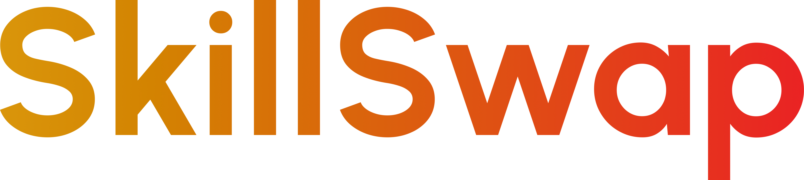

__SkillSwap__ is a modern platform designed to facilitate skill exchange, connecting people in the digital environment who want to learn with those willing to share their knowledge.

--------------------------------------------------------------------------------------------------------

## Why SkillSwap?

Updating and strengthening our skills is crucial, especially in a constantly evolving digital environment. SkillSwap addresses the challenges of collaborative learning, offering a smooth and effective digital experience for knowledge exchange.

## Objectives

Facilitate continuous learning and collaborative teaching, creating a vibrant community where users can explore their interests and direct their personal and professional development.

--------------------------------------------------------------------------------------------------------

## Project Structure

```bash
├── /public
│   ├── /img
│   ├── /svg
│   └── /vid
├── /src
│   ├── /app
│   │   ├── /(account)
│   │   │   └── /auth
│   │   │       ├── /password/reset
│   │   │       ├── layout.tsx
│   │   │       └── page.tsx
│   │   ├── /admin
│   │   │   ├── /legal
│   │   │   ├── /reports
│   │   │   ├── /users
│   │   │   ├── layout.tsx
│   │   │   └── page.tsx
│   │   ├── /user
│   │   │   ├── /(settings)
│   │   │   │   ├── /info
│   │   │   │   ├── /profile
│   │   │   │   └── /social
│   │   │   ├── /detail/u/[id]
│   │   │   ├── /discover
│   │   │   ├── /legal
│   │   │   ├── /match
│   │   │   ├── layout.tsx
│   │   │   └── page.tsx
│   │   ├── /legal
│   │   ├── /api
│   │   ├── page.tsx
│   │   ├── layout.tsx
│   │   ├── not-found.tsx
│   │   ├── Providers.tsx
│   │   ├── ClientLayout.tsx
│   │   └── RouteHandler.tsx
│   ├── /shared
│   │   ├── /hooks
│   │   ├── /styles
│   │   ├── /types
│   │   └── /ui
│   │       ├── /atoms
│   │       ├── /molecules
│   │       ├── /organisms
│   │       └── /screens
│   ├── /core
│   │   ├── /dto
│   │   └── /models
│   ├── /features/any
│   │   ├── /types
│   │   ├── /hooks
│   │   ├── /components
│   │   └── anySlice.ts
│   ├── /lib
│   │   ├── /utils
│   │   └── store.ts
│   └── middleware.ts
├── .env*
├── .gitignore
├── .dockerignore
├── package.json
├── Dockerfile
├── README.md
└── ...
```

--------------------------------------------------------------------------------------------------------

<h1 align="center">Tech Stack</h1>
<p align="center">
    
    
    
    
    
</p>

--------------------------------------------------------------------------------------------------------

## Frontend

- `TypeScript`

- `Next.js`

- `Docker`

- `Redux Toolkit`

- `Styled Components`

- `React-based libraries`

## Backend

- `Dotnet`

- `C-Sharp`

- `Docker`

- `Swagger`

- `Azure`

- `Render`

--------------------------------------------------------------------------------------------------------

<h1 align="center">SkillSwap Team</h1>
<p align="center">
   <a href="https://github.com/franccoina" target="_blank"></a>
   <a href="https://github.com/medi77na" target="_blank"></a>
   <a href="https://github.com/luisaramicar11" target="_blank"></a>
   <a href="https://github.com/JoanZapata05" target="_blank"></a>
   <a href="https://github.com/Arlexz96" target="_blank"></a>
   <a href="https://github.com/JEscobar07" target="_blank"></a>
   <a href="mailto:skillswapten@gmail.com" target="_blank">
   
   </a>
</p>

--------------------------------------------------------------------------------------------------------

## Frontend

- `franccoina` David Francisco Blandón Mena

- `luisaramicar11` Luisa Fernanda Ramírez Cardona

- `JoanZapata05` Joan Sebastián Zapata Caro

## Backend

- `Arlexz96` Arlex Mauricio Zapata Mesa

- `JEscobar07` Jonathan Escobar Molina

- `medi77na` David Steven Medina Urrego

--------------------------------------------------------------------------------------------------------  

## Resources

1. In this link, you can view the Documentation of our project on Notion:
    - [Go to Notion](https://plum-pig-ed5.notion.site/SKILLSWAP-8fa0afeb7d144278894d643549d1e669)

2. In this link, you can view the Task Management and Sprints of our project on Jira:
    - [Go to Jira](https://msgamesje.atlassian.net/jira/software/projects/SCRUM/boards/1?atlOrigin=eyJpIjoiNTFhZDYxYjI1NTU0NGZjMmFlMjVkMWRjNTM5ODk3YzkiLCJwIjoiaiJ9)

3. In this link, you can view the MockUp and Prototype Design of our project on Figma:
    - [Go to Figma](https://www.figma.com/design/FEDH5WgaGXBLSr2xBBA8OV/SkillSwap.ts-Mockup?node-id=0-1&t=mbwWpVTL1rtoLHnZ-1)

4. In this link, you can view our project deployed on Vercel:
    - [Go to SkillSwap](https://skillswapten.vercel.app)

5. In this link, you can explore the team's repository for backend develop and deploy:
    - [Go to Backend Repository](https://github.com/SkillSwap-Ten/SkillSwap)

6. You are here right now! Be sure to explore our team's repository for frontend develop and deploy:
    - [Go to Frontend Repository](https://github.com/SkillSwap-Ten/Skiller)

*P.S: In case you'd like to get in touch with our team, feel free to email us at* __skillswapten@gmail.com__.

--------------------------------------------------------------------------------------------------------

## Auth Credentials

To access the admin panel, use the following credentials:

- *Email*: <arlex.z96@gmail.com>
- *Password*: @A12345

To access the user overview, use the following credentials:

- *Email*: <davidmedina@gmail.com>
- *Password*: @A12345

*P.S: These credentials are provided only for demo/testing purposes. Do not use them in production environments.*

--------------------------------------------------------------------------------------------------------

## Installation

1. Clone the repositories exactly as below:

```bash
# Frontend repository
git clone https://github.com/SkillSwap-Ten/Skiller.git   

# Backend repository     
git clone https://github.com/SkillSwap-Ten/SkillSwap.git   
```

2. Move into the Frontend directory and install the dependencies:

```bash
# Move into frontend folder (install project packages and dependencies)
cd Skiller
npm install
```

3. Due to the `.gitignore`, you may not have the environment variables file when cloning this project. To solve this, create an `.env` file __on the root directory of the frontend project__ (`/Skiller`):

```bash
# File name
.env
```

4. Then, place there the three environment variables according to the instructions below:

- `NEXT_PUBLIC_GITHUB_API_URL`: GitHub API URL (default: <https://api.github.com/users>)
- `NEXT_PUBLIC_BASE_API_URL`: SkillSwap API URL (default: <https://skillswap-qww9.onrender.com/api>)
- `GITHUB_TOKEN`: GitHub API TOKEN (secret: [you_can_create_it_on_your_own])

*P.S: You can generate your own GITHUB token by following the instructions on [GitHub Docs](https://docs.github.com/en/authentication/keeping-your-account-and-data-secure/managing-your-personal-access-tokens)... or just go to the end of this document, where we will explain it to you.*

```bash
# .env.example (Guide for .env file content)
NEXT_PUBLIC_GITHUB_API_URL=github_url_here
NEXT_PUBLIC_BASE_API_URL=skillswap_url_here
GITHUB_TOKEN=your_generated_token_here
```

5. Now, move into the Backend directory:

```bash
# Move into backend folder (contains docker-compose.yml)
cd ..
cd SkillSwap  
```

6. Run the project container in the terminal with Docker. Choose __ONLY ONE__ of the following options:

```bash
# Both Backend and Frontend for production (Next with `npm run start`)
docker compose up --build

# Backend for production and Frontend for dev (Next with hot reload `npm run dev`)
docker compose run --service-ports Skiller npm run dev
```

7. Open [http://localhost:3000](http://localhost:3000) on your browser and enjoy our project.

--------------------------------------------------------------------------------------------------------

### How to Generate a GitHub Personal Access Token

1. __Log in to GitHub__:
   - Go to [GitHub](https://github.com) and log in to your account.

2. __Navigate to Settings__:
   - Click on your profile picture in the top right corner.
   - Select __Settings__ from the dropdown menu.

3. __Access Developer Settings__:
   - In the left sidebar, scroll down and click on __Developer settings__.

4. __Personal Access Tokens__:
   - Click on __Personal access tokens__ in the left sidebar.
   - Select __Tokens (classic)__.

5. __Generate New Token__:
   - Click on the __Generate new token__ button.

6. __Set Token Scopes__:
   - Give your token a descriptive __note__.
   - Set the __expiration__ for the token as needed.
   - Select the scopes for the token:
     - __repo__: Full control of private repositories.
     - __user__: Read and write access to profile data.

7. __Generate and Copy the Token__:
   - Click on __Generate token__.
   - __Copy__ the generated token. You won’t be able to see it again!

8. __Store Your Token__:
   - Save your token securely, such as in a `.env` file, and use it in your project as needed.

### Remember

Make sure to keep your token private. If you believe it has been compromised, revoke it immediately and generate a new one.

--------------------------------------------------------------------------------------------------------

<br>
<div align="center">
     <em>We thank you very much for visiting our loved project.</strong></em><br>
        <em>Greetings from <strong>SkillSwap Team.</strong></em>
</div>
<br>

--------------------------------------------------------------------------------------------------------

<div align="center">
  
</div>

<div align="center">
    <em>
      <strong>2024 SkillSwap. Looking for Skill.</strong><br>
      © All rights reserved.
       </em>
</div>
